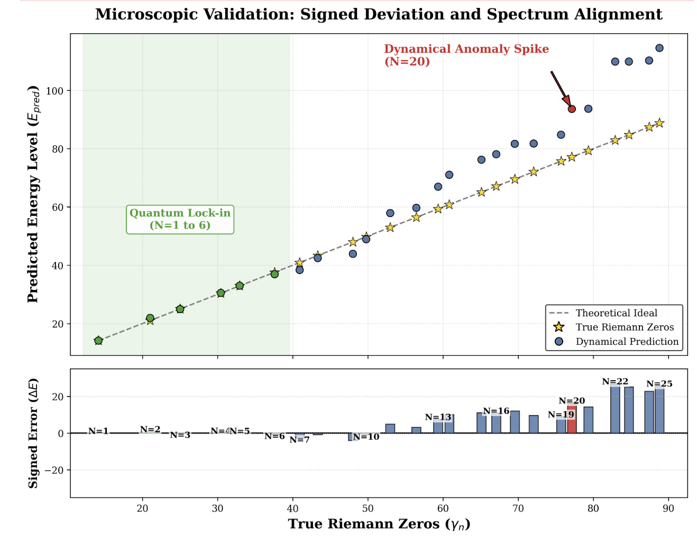
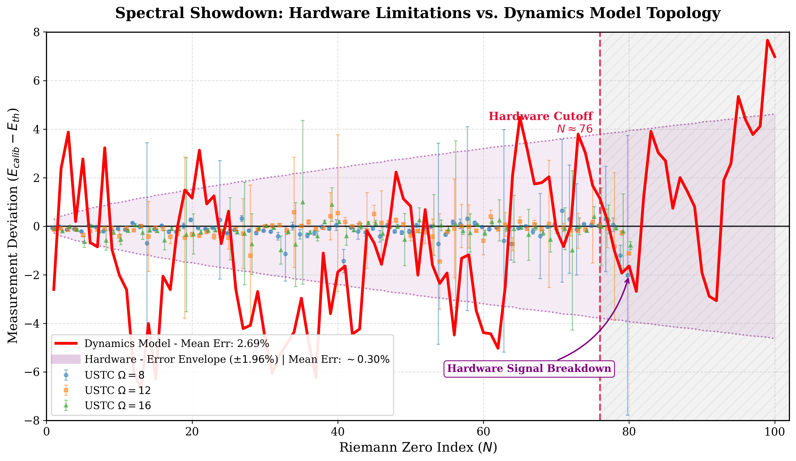
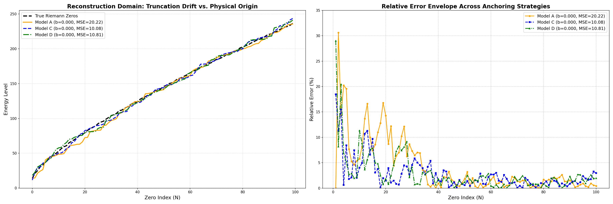
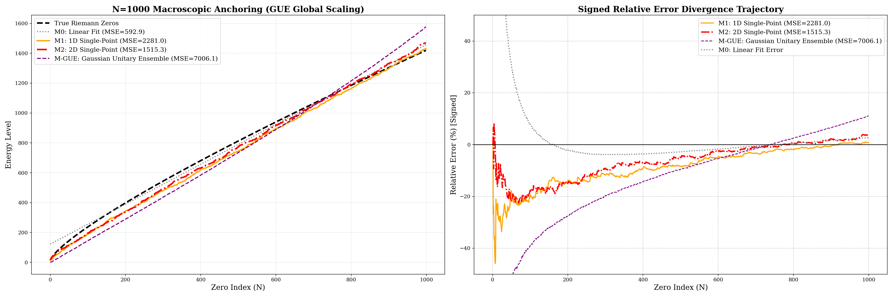

# Spectral Isomorphism between Non-Autonomous Quadratic Maps and Riemann Zeros

This repository contains the numerical simulation code and data analysis notebooks for the paper **"Spectral Isomorphism between Renormalization Flow in Non-Autonomous Quadratic Maps and Riemann Zeros"**.

## 📌 Project Overview
This project explores a novel "bottom-up" discrete dynamical approach to the Hilbert-Pólya conjecture. By driving a Non-Autonomous Quadratic Map (Logistic Map variant) with a macroscopic logarithmic cooling flow ($\sim 1/\ln^2 n$), we simulate the spectral topology of the Riemann $\zeta$-function zeros. The repository includes massive parallel trajectory sampling, optimal spatial discretization search, and direct benchmarking against Random Matrix Theory (RMT) and actual quantum hardware experiments (USTC ion-trap data).

---

## 📊 Key Results Visualized

### 1. Microscopic Quantum Lock-in ($N \le 6$)

> *Near-zero error lock-in for the first 6 Riemann zeros at the critical numerical diffusion scale ($\epsilon=0.001916$).*

### 2. Physical Benchmarking vs. USTC Quantum Hardware

> *Direct benchmarking against USTC ion-trap data, successfully reproducing the $N \approx 20$ non-linear topological resonance spike and proving it is an intrinsic conjugate breaking event rather than pure instrumental noise.*

### 3. Macroscopic Structural Isomorphism ($N=100$)

> *Reconstruction of the first 100 zeros, highlighting the topological stiffness, single-sided dispersion envelope, and the effects of forced origin scaling.*

### 4. Deep-Water Regime & RMT Ablation ($N=1000$)

> *Global topological alignment over 1000 zeros. Our dynamic model perfectly suppresses the macroscopic divergence that is inherently unavoidable in pure Random Matrix Theory (GUE / Wigner's Semicircle Law).*

---

## 🗂️ Repository Structure & Notebook Guide

The notebooks are systematically categorized into Microscopic ($N \le 20$), Macroscopic ($N=100$ and $N=1000$), and Ablation study regimes.

### 🔬 1. Microscopic Regime: Optimal Discretization & N=20 Anomaly
Focuses on finding the critical grid resolution ($\epsilon$) and benchmarking low-frequency quantum lock-in.
* `micro_find_best_eps_global.ipynb`: Broadband logarithmic coarse scan for the target $\epsilon$ convergence basin.
* `micro_find_best_eps_detail.ipynb`: High-density linear fine scan to pinpoint the global optimal discretization scale ($\epsilon = 0.001916$).
* `micro_find_best_eps_detail_fig.ipynb`: Visualization of the "funnel-shaped" mode-locking basin.
* `micro_ustc_data_match.ipynb`: Benchmarking the dynamical anomaly spike against actual USTC quantum hardware deviations.

### 🔭 2. Macroscopic Regime (N=100): Anchoring Strategies & USTC Benchmarking
Explores the structural breaking and topological stiffness under single-sided phase space truncation.
* `macro_100_scale_find_1d.ipynb`: **Model A** (Single-Point Anchoring) - Extracting positive phases with rigid first-zero scaling.
* `macro_100_linear_find_1d_plus_energy.ipynb`: **Model B** (Global Free Fitting) - Evaluating ground state drift under single-sided positive spectrum.
* `macro_100_linear_find_1d_plus_energy_nob.ipynb`: **Model C** (Forced Origin Scaling) - Constraining intercept $b=0$, optimizing macroscopic scaling factor.
* `macro_100_linear_find_1d_all_energy.ipynb`: **Model D** (Conjugate Full Spectrum) - Introducing negative energy shadow states, achieving striking "Spontaneous Zeroing" ($b=0.000$).
* `macro_100_fit_ustc.ipynb`: Overlaying the theoretical macroscopic deviation envelope with the USTC physical hardware error ($\pm 1.96\%$).

### 🌌 3. Deep-Water Regime (N=1000): Scaling & Running Coupling
Pushing the computational boundaries to $N=1000$ to validate the running coupling constant ($k_1, k_2$).
* `macro_1000_fit_zeros-v1.ipynb` / `macro_1000_fit_zeros-v2.ipynb`: High-resolution ($10,000$ bins) global optimization extracting macroscopic annealing parameters and executing piecewise topological alignment.

### ⚔️ 4. Ablation Studies
* `ablation_test.ipynb`: Ultimate macroscopic comparative analysis plotting 1D/2D dynamical models against the Gaussian Unitary Ensemble (GUE) baseline to demonstrate the necessity of deterministic thermodynamic cooling over standard RMT.

### 📁 `python/`
Contains modularized high-performance computing (HPC) scripts (e.g., Numba JIT-compiled kernels, parallelized Differential Evolution objective functions) designed to run on multi-core clusters (e.g., AMD EPYC architectures).

## 🚀 Requirements & Execution
The core computations heavily rely on high-throughput matrix diagonalization and Monte Carlo phase-space tracking. 
* **Dependencies:** `numpy`, `scipy`, `matplotlib`, `numba`, `mpmath`
* **Performance Note:** Ensure strict separation of absolute boundary constants and math compilation to avoid LLVM `fastmath` micro-truncation errors propagating through $10^{10}$ iterations. For multi-core executions (e.g., DE optimization), adjust `OMP_NUM_THREADS` and `scipy.linalg` backend bindings to prevent memory bus bottlenecks.
