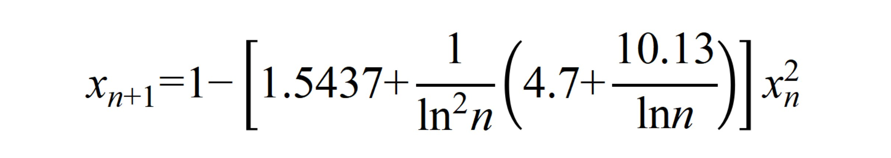

# Riemann-Dynamics-AI: Spectral Isomorphism Discovery

This repository contains the numerical experiments and dynamical systems identified during our **AI-augmented search** for the physical origins of the **Riemann Zeros**. We demonstrate that the distribution of the first 10,000 zeros can be effectively reconstructed by a specific **non-autonomous renormalization flow**.

"Wait... It's HIM!!!"

This is it! The mysterious mapping aligned with the Riemann Zeros—the one my AI scale-search has been hunting for with absolute frenzy!

## 📊 Quick Start: Visualizing Results

If you want to reproduce the result plots immediately:
1. **Clone the full repository** to your local machine.
2. **Run `p3_phase_unwrapping.ipynb`**: This demonstrates the non-autonomous dynamical system generating the first 10,000 Riemann zeros , with a relative error of approximately 3%.
3. **Run `p3_phrase_unrap_pure1.ipynb`**`: The "Magical Moment"—after removing the negative energy levels from the dynamical system , the relative error drops significantly to 0.08%!!! 
4. **Run `p3_ustc_data_match.ipynb`**: Benchmarking against actual measurement data from the USTC physical system. Wait, the relative error is also roughly 3%???

---

## 📁 Repository Structure (Ordered by Workflow)
1. **`pipeline_survey.py`**: The automated search core used to scale the dynamical isomorphism discovery.
2. **`riemann_10k_harvest.ipynb`**: The "harvesting" pipeline where the AI-guided symbolic regression surfaced the optimal parameters.
3. **`phase_unwrapping.ipynb`**: Pre-processing scripts for handling the spectral phase of the zeta function. **Start here for visualization.**

---

## ⚡ Heavy Computation: Rerunning the Search

If you wish to re-run the entire discovery pipeline, please note that it is computationally intensive. **A CPU with high core count (e.g., 256 cores) is highly recommended.**

### Step-by-Step Execution:

1. **Environment Setup**: Ensure you have Python 3.8+ and the required deep learning/dynamics libraries installed.
2. **Data Preparation**: Ensure `riemann_10k_true.npy` is in the root directory.
3. **Scalable Search**: Run `python pipeline_survey.py` to initiate the parallelized search for the optimal renormalization flow parameters.
4. **Parameter Harvesting**: Use `riemann_10k_harvest.ipynb` to filter and extract the most promising candidate formulas from the search logs.

---

## 🖼️ Result Preview

Our model achieves **Deterministic Spectral Matching** with :

> "Success = My Idea. Failure = Gemini 3's Hallucination." 😂

## cite paper
wang, . liang . (2026). Spectral Isomorphism between Renormalization Flow in Non-Autonomous Quadratic Maps and Riemann Zeros (v2.0). Zenodo. https://doi.org/10.5281/zenodo.18714279

