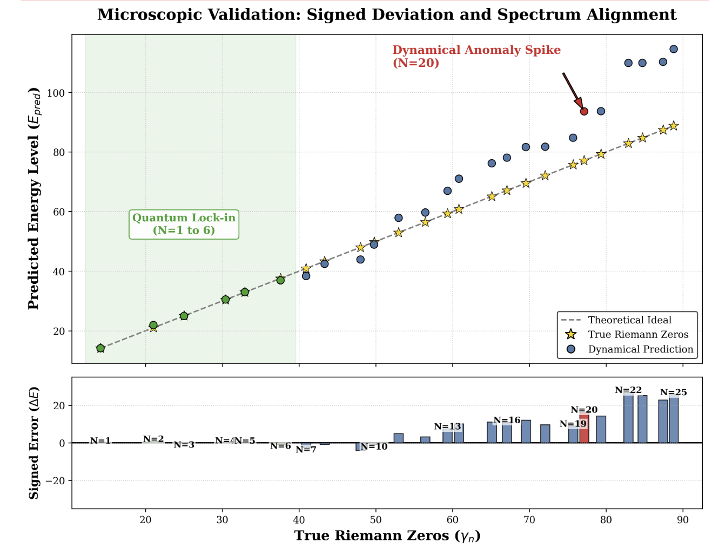

# Riemann-Dynamics-AI: Spectral Isomorphism Discovery

This repository contains the numerical experiments and dynamical systems identified during our **AI-augmented search** for the physical origins of the **Riemann Zeros**. We demonstrate that the distribution of the first 10,000 zeros can be effectively reconstructed by a specific **non-autonomous renormalization flow**.

"Wait... It's HIM!!!"

This is it! The mysterious mapping aligned with the Riemann Zeros—the one my AI scale-search has been hunting for with absolute frenzy!

## 📊 Quick Start: Visualizing Results

If you want to reproduce the result plots immediately, you have two options:
1. Run in Cloud (Highly Recommended): Simply click the "Open in Colab" badge next to each file below. This will launch a pre-configured environment in your browser—no local setup required.(Tip: To keep this page open, we recommend Ctrl + Click (or Cmd + Click on Mac) the "Open in Colab" badges to launch them in a new tab.)
2. Local Execution: Clone the full repository to your local machine and run the notebooks manually.

* **Run `p3_phase_unwrapping.ipynb`**:  This demonstrates the non-autonomous dynamical system generating the first 10,000 Riemann zeros , with a relative error of approximately 3%
* **Run `p3_phrase_unrap_pure1.ipynb`**:   The "Magical Moment"—after removing the negative energy levels from the dynamical system , the relative error for the first 10,000 Riemann zeros drops significantly to 0.08%!!! 
* **Run `p3_ustc_data_match.ipynb`**:  Benchmarking against actual measurement data from the USTC physical system. Wait, the relative error is also roughly 3%??? 😲 It feels like we’ve stumbled upon something legendary! 🚀 Negative energy??? 🌌 The Dirac Sea within Riemann Zeros!!! 🌊✨

---

## ⚡ Heavy Computation: Rerunning the experiments

⚠️ **Computational Resource Requirement**: The full simulation of 10,000 modes involves massive parallel matrix operations. It is highly recommended to run these experiments on a high-core CPU server (e.g., 256 cores or more). For users without local HPC access, cloud GPU/CPU instances such as AutoDL, vast.ai, or Lambda Labs are recommended to ensure numerical stability and reasonable execution time.

**Macroscopic Experiments: Generation of the First 10,000 Riemann Zeros** 

**Full Spectrum Section:**

1. **`p3_riemann_10k_harvest.ipynb`**: Generation of the non-autonomous system transfer matrix.
2. **`p3_phase_unwrapping.ipynb`**: Basic linear fitting and matching with the first 10,000 zeros.
3. **`p3_fit_high_order_10k.ipynb`**: High-order fitting and matching with the first 10,000 zeros.
4. **`p3_ustc_data_match.ipynb`**: Benchmarking against actual measurement data from the USTC physical system.
   
**Negative Energy Removal Section:**
1. **`p3_riemann_10k_harvest_pure.ipynb`**: Generation of the non-autonomous system transfer matrix with negative energy levels removed, retaining only positive energy levels.
2. **`p3_phrase_unrap_pure1.ipynb`**: Basic linear fitting and matching with the first 10,000 zeros using only positive energy levels.

**Microscopic Experiments: Generation of the First 20 Riemann Zeros** 
1. **`p4_find_best_eps_global.ipynb`**: Coarse-grained search for the  (eps) parameter.
2. **`p4_find_best_eps_detail.ipynb`**: Fine-grained search for the  (eps) parameter.
3. **`p4_ustc_data_match.ipynb`**: Generation of the first 20 Riemann zeros under optimal parameters and comparison with USTC data.

---

## 🖼️ Result Preview
1. **Generation of 10,000 Riemann zeros via the non-autonomous dynamical system.**

2. **Generation of 10,000 Riemann zeros after the elimination of negative energy components.**

3. **Benchmarking and alignment with USTC physical measurement data.**

   
4. **Microscopic analysis of the generation of the first 20 Riemann zeros.**

Our model achieves **Deterministic Spectral Matching** with :

> "Success = My Idea. Failure = Gemini 3's Hallucination." 😂

## Cite Paper
wang, . liang . (2026). Spectral Isomorphism between Renormalization Flow in Non-Autonomous Quadratic Maps and Riemann Zeros (v2.0). Zenodo. https://doi.org/10.5281/zenodo.18714279

