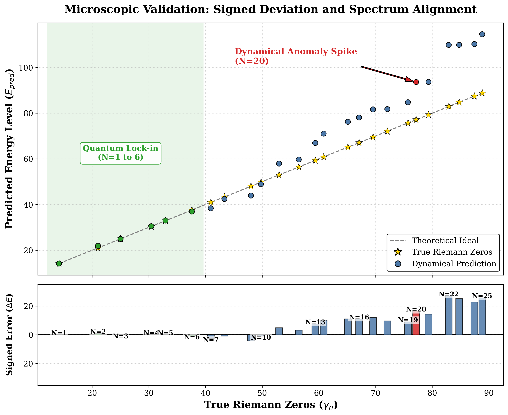
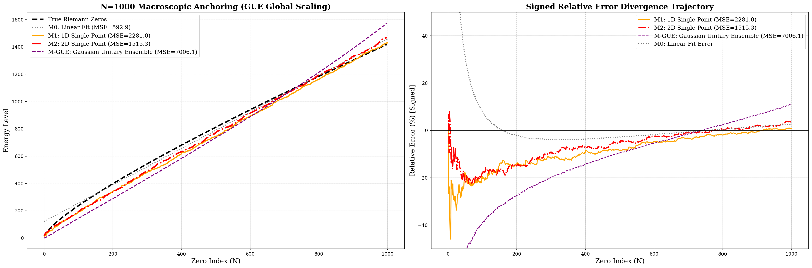

# Spectral Isomorphism between Non-Autonomous Quadratic Maps and Riemann Zeros

This repository contains the numerical simulation code, data-analysis notebooks, and
the manuscript sources for the paper **"Spectral Isomorphism between Renormalization
Flow in Non-Autonomous Quadratic Maps and the Riemann Zeros: A Numerical Study"**
(submitted to *Mathematical and Computational Applications*, see `paper/mca/`).

The project explores a "bottom-up" numerical construction related to the
Hilbert–Pólya conjecture: driving a non-autonomous quadratic map (a logistic-map
variant) with a logarithmic cooling schedule ($\mu_n \sim 1/\ln^2 n$), building an
empirical transfer matrix (Ulam's method) from its trajectory, and comparing the
matrix's eigenphases numerically against the non-trivial zeros of the Riemann
$\zeta$-function. **All claims in the paper are explicitly numerical and heuristic,
not proofs** — see `Table~\ref{tab:claims}` in the manuscript for the epistemic
status of every individual result, including several that this repository's own
code refutes (out-of-sample extrapolation, GUE local-statistics match).

<p align="center">
  
  
</p>
<p align="center"><sub>Left: microscopic lock-in (N=1-6) and the N=20 residual anomaly (Figure 2 in the manuscript). Right: N=1000 macroscopic fit (models M1/M2) against a GUE global-scaling baseline (Figure 6).</sub></p>

---

## Repository layout

```
readme.md                        <- this file
paper/mca/main.tex                <- current manuscript (MCA submission)
paper/mca_review/                 <- referee reports received on the prior submission

micro_*.ipynb                     <- N<=20 regime: optimal grid resolution, USTC comparison
macro_100_*.ipynb                 <- N=100 regime: anchoring-strategy ablations (Models A-D)
macro_1000_fit_zeros-v{1,2}.ipynb <- N=1000 regime: 1D/2D macroscopic fit, GUE ablation
ablation_test.ipynb               <- combined 1D/2D vs. GUE ablation figure
python/                           <- earlier standalone HPC scripts (superseded by task*.py below)

task12_13_experiments_v2.py       <- out-of-sample validation + multi-seed robustness (Tasks 12-13)
task14_rmt_unfolded.py            <- unfolded local-statistics KS test, true Riemann zeros vs GUE/Poisson
task14_dynamical_rmt.py           <- same KS test applied to this model's own eigenphases (Task 14)
task15_n20_significance.py        <- unbiased re-verification + significance test of the N=20 "spike" (Task 15)

task12_13_results_v2/             <- JSON output of task12_13_experiments_v2.py (already generated)
task14_rmt_statistics/            <- JSON + PNG output of the two task14 scripts (already generated)
task15_n20_significance/          <- JSON output of task15_n20_significance.py (already generated)
task12_13_v2.log, task15_v1.log   <- captured stdout from the runs that produced the above

backup/                           <- superseded exploratory work, kept only for provenance (not needed
                                     to reproduce anything in the paper; see below)
  mvp2/, mvp3/                    <- earlier iterations of the analysis, before the current notebooks
  mvp4/                           <- the iteration that the current root-level notebooks/scripts were
                                     promoted from; kept as a frozen snapshot of that state
  lecture/                        <- unrelated teaching notebooks on chaos/logistic maps (context only)
  paper_drafts/                  <- earlier manuscript drafts/templates (fracfract, sr, MDPI templates,
                                     an old .docx) predating the current paper/mca/ submission
```

Every `task*.py` script is self-contained (uses `pathlib.Path(__file__)` to locate
its own output directory) and can be re-run from any working directory as long as
you invoke it with `python3 <script_name>.py` from inside a clone of this repo, or
`python3 /path/to/repo/task14_dynamical_rmt.py`.

## Requirements

Tested with:

```
Python      3.12
numpy       2.4.4
scipy       1.16.1
numba       0.67.0
mpmath      1.3.0
matplotlib  3.10.5
```

Install with:

```bash
pip install numpy scipy numba mpmath matplotlib
```

No GPU is required. `numba`'s `@njit(fastmath=True)` JIT-compiles the inner
simulation loops to native code on first call (a few seconds of one-time
compilation overhead per script).

**Hardware note:** the `task12_13_experiments_v2.py` full run (steps=$10^{10}$,
13 configurations) was executed on a 64-core machine and took **~176 minutes**
wall-clock with all 13 configurations running in parallel (one process per
configuration, `OMP_NUM_THREADS=1` set inside the worker to avoid oversubscribing
BLAS threads across processes — see the `Design of Ablation Studies` /
`Parameter Optimization Methods` note in `main.tex` for the reasoning). On a
machine with fewer cores, `multiprocessing.Pool` will simply run more of the 13
configurations sequentially; wall-clock time scales roughly as
`13 / min(13, n_cores) * ~2.3 hours per configuration`. There is no correctness
requirement on the parallelism — every configuration is fully independent — so it
is safe to reduce `n_workers` or run individual configurations one at a time if
memory or wall-clock time is constrained.

`task15_n20_significance.py` builds a single dense-ish transition matrix at
`n_bins=6000` with a Gaussian-kernel-broadened diffusion step (heavier than a
plain point map); this one-time step took **~82 minutes** on the same machine.
The subsequent 20 eigendecomposition trials are fast (seconds each) by comparison.

`task14_rmt_unfolded.py` and `task14_dynamical_rmt.py` are fast (a few minutes
each): they operate on already-small eigenphase/zero sets (100 values).

## How to reproduce each numbered result in the paper

The manuscript's numerical claims map onto scripts/notebooks as follows. Where a
script has already been run, its output is committed under the corresponding
`task*_results*/` or `task*_statistics/` directory, together with the captured
log — so you can inspect the exact numbers without re-running anything, or re-run
to confirm reproducibility.

| Paper section | What it reports | How to reproduce |
|---|---|---|
| §Microscopic Results ($N\le20$), optimal grid resolution $\epsilon$ | The funnel-shaped mode-locking basin and $\epsilon=0.001916$ optimum | `micro_find_best_eps_global.ipynb` (coarse scan) → `micro_find_best_eps_detail.ipynb` (fine scan) → `micro_find_best_eps_detail_fig.ipynb` (figure) |
| §Statistical Significance of the USTC Coincidence (`sec:n20-significance`) | Unbiased 20-trial N=20 residual statistics (mean 11.76, std 1.59), rank #67/85, Spearman $\rho=0.56,\ p=0.010$, permutation $p=0.099$ | `python3 task15_n20_significance.py` — reproduces `task15_n20_significance/results.json`. **Warning:** ~85 minutes, dominated by the one-time transition-matrix build. The original *cherry-picked* version of this experiment (which selects the trial that maximizes the N=20 spike) is `micro_ustc_data_match.ipynb`; do not use its single reported number as a robustness claim — that is exactly the selection bias this task's script corrects for. |
| §Macroscopic Regime ($N=100$), anchoring-strategy ablation (Models A-D) | Single-point vs. forced-origin vs. conjugate-full-spectrum fits, Figure 4 | `macro_100_scale_find_1d.ipynb` (A), `macro_100_linear_find_1d_plus_energy.ipynb` (B), `macro_100_linear_find_1d_plus_energy_nob.ipynb` (C), `macro_100_linear_find_1d_all_energy.ipynb` (D), overlay in `macro_100_fit_ustc.ipynb` |
| §Out-of-Sample Validation and Multi-Seed Robustness (`sec:oos`) | Train/test MSE gap at $M\in\{50,70,80\}$; 10-seed CV $\approx4.7\%$ at fixed $M=70$ | `python3 task12_13_experiments_v2.py` — reproduces all 13 JSON files in `task12_13_results_v2/` (3 out-of-sample splits + 10 seeds). See hardware note above; ~3 hours on 13+ cores. |
| §Macroscopic Regime ($N=1000$), Figure 6 (M1/M2 vs. GUE) | 1D/2D fitted $k_1,k_2$ at 10,000 bins, MSE $\approx1515.3$ for the 2D model, GUE global-scaling baseline MSE $\approx7006.1$ | `macro_1000_fit_zeros-v2.ipynb` (uses `scale = true_zeros[0] / sim_zeros[0]`, i.e. strict single-point anchoring for M1/M2, and forced-origin global least squares for the GUE baseline — see `Spectral Fitting and Alignment Methodology` in `main.tex` for why these differ) |
| Discussion, `sec:gue-comparison`: dynamical model's own eigenphase spacing vs. GUE (unfolded, local) | KS test against GUE/Poisson for (a) the true Riemann zeros and (b) this model's eigenphases | (a) `python3 task14_rmt_unfolded.py` → `task14_rmt_statistics/rmt_statistics_results.json`; (b) `python3 task14_dynamical_rmt.py` → `task14_rmt_statistics/dynamical_system_rmt_results.json`. Both produce a spacing-distribution PNG alongside the JSON. |
| Ablation study, 1D/2D dynamics vs. GUE (macroscopic counting-function trend) | Combined comparison figure | `ablation_test.ipynb` |

## Notes on reproducibility and known sensitivities

- **Boundary anchoring precision.** The non-autonomous cooling schedule
  $\mu_n=\mu_{\text{end}}+k/\ln^2(n+c)$ is anchored so that the system reaches the
  exact critical point at the final step ($U_{\text{temp}}=U_c-k/\ln^2(N+c)$); see
  `paper/mca/main.tex`, §"Absolute Boundary Anchoring Method (1D)". Computing this
  anchor constant under `numba`'s `fastmath=True` (rather than in a strict
  IEEE-754 context first) can introduce $\sim10^{-15}$ relative error that gets
  amplified over $10^{10}$ iterations — see §"Numerical Stability and
  Compiler-Induced Butterfly Effects" in the manuscript. All scripts in this repo
  compute the anchor with plain NumPy scalar arithmetic *before* passing it into
  the JIT-compiled kernel, exactly to avoid this.
- **ARPACK run-to-run variability.** The sparse eigendecomposition
  (`scipy.sparse.linalg.eigs`) uses a random restart vector by default, so the
  extracted eigenphases (and hence the specific N=20 residual value in Figure 3 of
  the paper) vary slightly run to run. `task15_n20_significance.py` quantifies this
  variability explicitly rather than treating any single run as canonical.
- **Fitted parameters are in-sample.** `k_opt` (or $k_1,k_2$) is fit by minimizing
  error against the same Riemann zeros used for evaluation, at every scale in this
  repository except `task12_13_experiments_v2.py`'s Task 12 configurations,
  which are the one genuine out-of-sample test in the codebase. Its result
  (held-out MSE one to two orders of magnitude larger than training MSE) is
  reported honestly in the paper and should not be treated as a limitation
  specific to this repository's implementation — it is the central empirical
  finding of that section.

## Manuscript sources

`paper/mca/main.tex` is the current, actively maintained manuscript (MDPI/MCA
class files under `paper/mca/Definitions/`). Compile with:

```bash
cd paper/mca
pdflatex -interaction=nonstopmode main.tex
bibtex main
pdflatex -interaction=nonstopmode main.tex
pdflatex -interaction=nonstopmode main.tex
```

`paper/mca_review/` contains the four referee reports received on the previous
submission round; several of the fixes reflected in the current `main.tex` and in
`task12_13_experiments_v2.py` / `task14_*.py` / `task15_*.py` were made directly in
response to specific, itemized referee comments (e.g. the out-of-sample test, the
multi-seed robustness check, the unfolded-GUE local-statistics test, and the
single-point-vs-multi-point anchoring inconsistency between the Results and
Appendix sections).

The manuscript's Appendix also has its own self-contained
"Reproducibility Guide: Recommended Hardware and Experimental Pipeline"
subsection, summarizing the same hardware recommendations and step-by-step
pipeline as this readme, for readers who only have the PDF.

## Data availability

The reference Riemann zeros used throughout are obtained from `mpmath.zetazero`
(arbitrary-precision, deterministic — no external data files needed). The USTC
ion-trap experimental values used for the microscopic comparison are transcribed
inline in `task15_n20_significance.py` and `micro_ustc_data_match.ipynb` from the
published experiment; no proprietary data is used anywhere in this repository.
